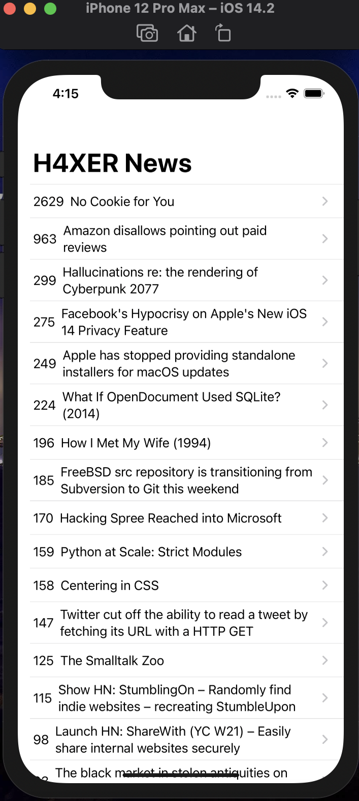
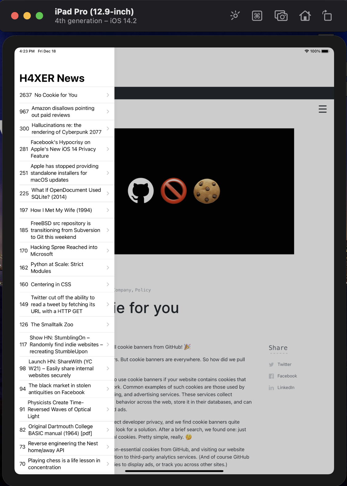
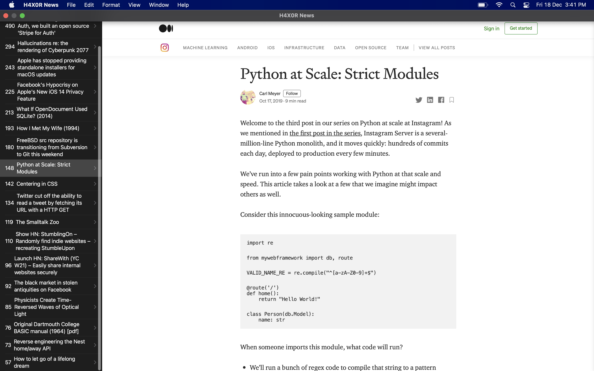
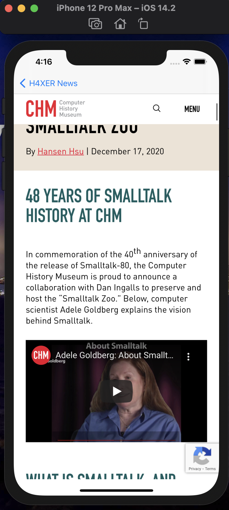
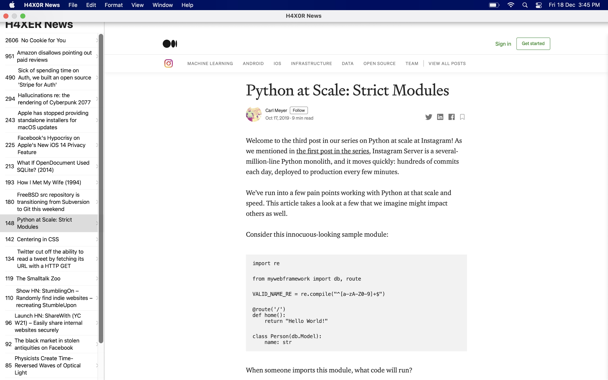
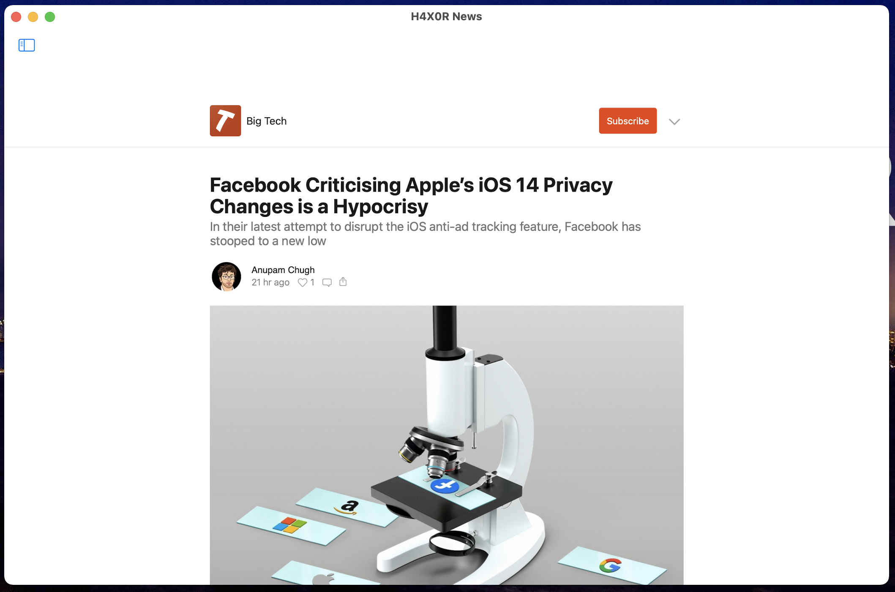

    

#  Hacker News

## What is it ?

* A news app which can run on iOS, iPadOS, and macOS devices using WebKit.
* It is implemented using Swift5 and XCode. 
* Use of Project Catalyst (announced by Apple in WWDC 2019)
* Use of HackerNews API by YCombinator.

## App Screenshots

 |  (On iOS device) |  (On iPadOS device) |  (On macOS device)|
 |:---:|:---:|:---:|
 
 | (News on iOS) | (News on macOS) | (Full Screen Mode) | 
 |:---:|:---:|:---:|

